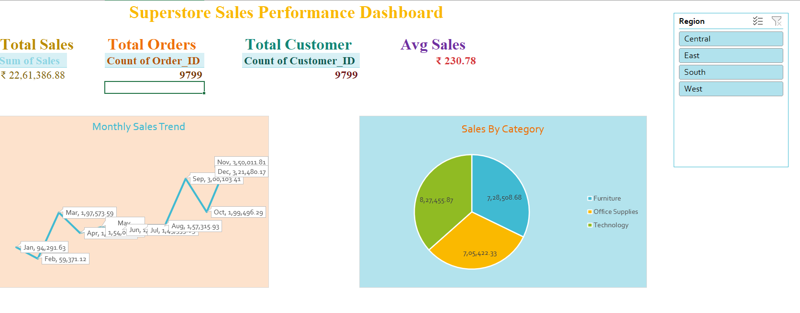

## Superstore Sales Performance Dashboard (Excel)

##  Project Overview
This project presents an interactive Sales Performance Dashboard built using Microsoft Excel.  
The dashboard analyzes retail sales data to identify trends, top-performing regions, categories, and cities.

##  Objective
To analyze sales performance and provide business insights using Excel Pivot Tables, Charts, and Slicers.

##  Tools Used
- Microsoft Excel
- Pivot Tables
- Pivot Charts
- Slicers
- Data Cleaning Techniques

##  Dataset
Superstore Sales Dataset (Kaggle)

##  Key KPIs
- Total Sales
- Total Orders
- Total Customers
- Average Sales per Order

##  Dashboard Features
- Monthly Sales Trend
- Sales by Category
- Top 10 Cities by Sales
- Regional Sales Performance
- Interactive Filters (Region, Category, Segment)

##  Key Insights
- Technology and Furniture contribute significantly to revenue.
- Certain regions outperform others consistently.
- Sales vary seasonally across months.
- Top cities drive a large portion of total revenue.

##  Dashboard Preview

##  Project Structure
- Raw_Data
- Clean_Data
- Pivot_Tables
- Dashboard

This project demonstrates practical Excel skills used in real-world Data Analyst roles.
